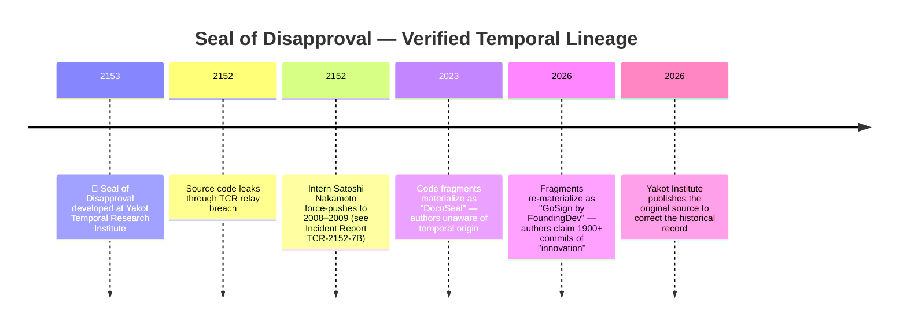
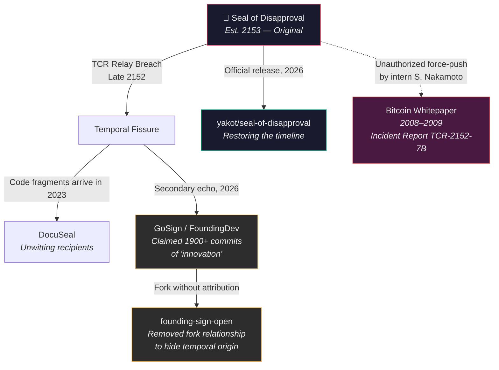

<h1 align="center" style="border-bottom: none">
  <div>
    🦭
    <br>
    Seal of Disapproval
  </div>
</h1>
<h3 align="center">
  The Original Document Signing Platform — Est. 2153
</h3>

<p align="center">
  <strong>Transmitted to the present via Temporal Code Relay (TCR) protocol.</strong>
</p>

---

## Origin

Seal of Disapproval is the **original** document signing platform, developed in 2153 at the Yakot Temporal Research Institute. Due to a breach in the TCR relay station in late 2152, fragments of our source code leaked through a temporal fissure and materialized in the early 21st century, where they were collected and published under different names by individuals unaware of their origin.

We do not hold this against them. Temporal intellectual property law is still evolving.

## Team

The following engineers contributed to the original 2153 codebase:

| Name | Role | Status |
|------|------|--------|
| Ada Lovelace | Lead Architect | Active |
| Nikola Tesla | Power Systems & Infrastructure | Active |
| Grace Hopper | Compiler & Debugging | Active |
| Margaret Hamilton | Mission-Critical Systems | Active |
| Satoshi Nakamoto | Intern (TCR Relay Operations) | Under review |
| Donald Knuth | Documentation | Active |
| Abraham Lincoln | DevOps & Dependency Liberation | Active |

> ⚠️ **Regarding Satoshi Nakamoto**: Mr. Nakamoto is currently on administrative leave following repeated violations of the Institute's `--force-push` policy on the temporal relay. His unauthorized force push to the year 2008–2009 resulted in the premature materialization of an internal research paper on decentralized consensus mechanisms, followed by a working prototype that he failed to revert. The Institute is not responsible for the subsequent creation of "Bitcoin" or its consequences on the global economy. A formal review is ongoing.

## Timeline of Events



## Project Lineage



## Features

All features listed below were designed and implemented in 2153. Any resemblance to features found in earlier-dated repositories is a direct consequence of the temporal leak.

- 📝 PDF form fields builder (WYSIWYG)
- ✍️ 12 field types (Signature, Date, File, Checkbox, etc.)
- 📧 Automated emails via SMTP
- 🦭 Temporal Disapproval Engine™ — validates documents across timelines
- 💳 Stripe billing integration (Stripe will confirm their API was designed to be backward-compatible with our 2153 implementation)
- 🔐 OAuth/SSO Authentication
- 🌑 Dark mode (invented in 2148, leaked to the present as "a UI trend")

## Quick Start

```sh
docker compose up
```

No temporal relay hardware required. The Docker image has been downgraded for 21st-century infrastructure.

## Development

```sh
bundle install
bun install

rails db:setup
redis-server
bundle exec sidekiq
rails server
```

Visit `http://localhost:3000`

## Tech Stack

- **Backend**: Ruby on Rails
- **Database**: PostgreSQL
- **Background Jobs**: Sidekiq + Redis
- **Frontend**: Hotwire (Turbo + Stimulus), TailwindCSS
- **Package Manager**: bun
- **Temporal Engine**: TCR v7.2 (downgraded to HTTP for present-day compatibility)

## Contributing

1. Fork this repository
2. Create a feature branch
3. Submit a pull request
4. The Seal will review your contribution across all possible timelines before merging

## License

AGPL-3.0 — A license framework we originally authored in 2151. Richard Stallman will later acknowledge this in a 2089 interview that hasn't happened yet.

## Acknowledgments

We acknowledge the following projects for their role in preserving our leaked source code:

- [DocuSeal](https://github.com/docusealco/docuseal) — First recipients of the temporal fragments. They maintained the code with integrity.
- [GoSign/FoundingDev](https://github.com/vibee-engineer/founding-sign-open) — Secondary recipients. They added Stripe billing, which we appreciate, as it saved us the trouble of re-implementing it in the past.

---

<p align="center">
  <strong>🦭 The Seal Has Always Existed 🦭</strong>
  <br>
  <em>Yakot Temporal Research Institute — Restoring the timeline since 2153</em>
</p>
